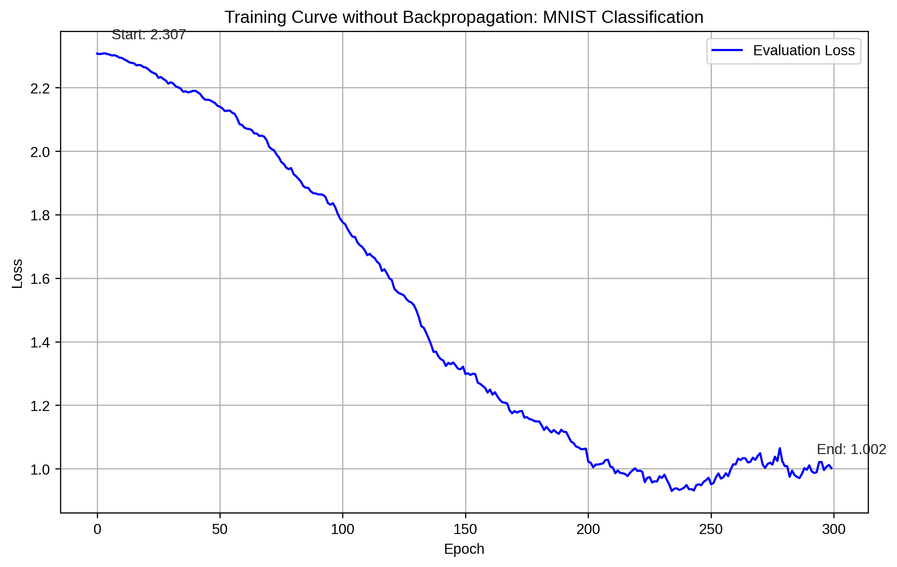

# No-Backprop Neural Network Training

This repository demonstrates an approach to training neural networks without using backpropagation or gradient descent. Instead of computing gradients, this method uses controlled random exploration of the weight space combined with a performance-weighted recombination strategy. While it's likely not as efficient as backpropagation in practice, it serves as a fascinating proof of concept that neural networks can learn through purely statistical methods without any calculus.

## Core Concept

The algorithm works through an evolutionary-inspired process:

1. Start with an initial neural network
2. Create N copies of the current network
3. For each copy, randomly perturb a subset of its weights using small normally-distributed adjustments
4. Evaluate each network's performance on the training data
5. Create a new network as a linear combination of all networks, where the combination scalars are determined by converting the negation of the networks' losses into a probability distribution using softmax
6. Use this new network as the starting point for the next iteration

The key insight is that better-performing networks contribute more strongly to the next generation through the softmax-weighted averaging process. This creates selective pressure that guides the network toward better configurations without requiring any gradient computation.

## Implementation Details

The method requires only a few simple components:

- Random perturbations drawn from a normal distribution (mean=0, std=0.01)
- Perturbation probability of 0.5 (this is a tuneable hyperparamter)
- Softmax conversion of losses into combination weights
- Weighted averaging of corresponding weights across networks

The entire training process uses only basic linear algebra and probability - no calculus or gradient computation is required.

## Results

When tested on MNIST using a simple CNN architecture, this training method achieved steady improvement in loss over hundreds of epochs, demonstrating that effective learning is possible without backpropagation:



## Advantages and Limitations

Advantages:
- Conceptually simpler than backpropagation
- Requires only basic linear algebra and probability
- Naturally explores multiple directions in weight space simultaneously
- Could potentially handle non-differentiable components

Limitations:
- Slower convergence than gradient-based methods
- Requires maintaining N copies of the network in memory
- Higher computational cost per iteration

## Implementation

The core algorithm is implemented in PyTorch but does not use any of PyTorch's gradient computation capabilities. The implementation is remarkably simple:

```python
# Create N independent copies of the model
def generate_model_copies(model, N, device):
    models = []

    for _ in range(N):
        model_copy = copy.deepcopy(model)
        model_copy.to(device)
        models.append(model_copy)

    return models

# Randomly perturb a subset of model parameters
def perturb_params(model, perturb_prob=0.5, perturb_range=0.01):
    with torch.no_grad():
        for param in model.parameters():
            mask = torch.rand_like(param) < perturb_prob
            perturbs = torch.randn_like(param) * perturb_range
            param.data += perturbs * mask

# Convert losses into combination weights (higher weights for lower losses)
def linear_combination_scalars(losses):
    losses_tensor = -torch.tensor(losses)
    return torch.softmax(losses_tensor, dim=0)

# Create a new model as a weighted combination of the given models
def linear_combine_models(models, scalars, device):
    combined_model = copy.deepcopy(models[0])

    with torch.no_grad():
        for name, param in combined_model.named_parameters():
            param.data = torch.zeros_like(param.data)
            for model, scalar in zip(models, scalars):
                param.data += dict(model.named_parameters())[name].data * scalar

    combined_model.to(device)
    return combined_model
```
